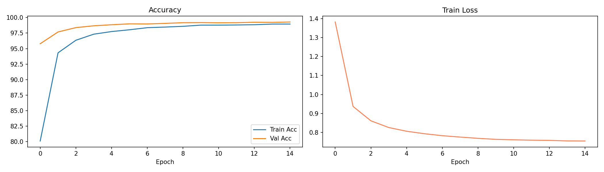
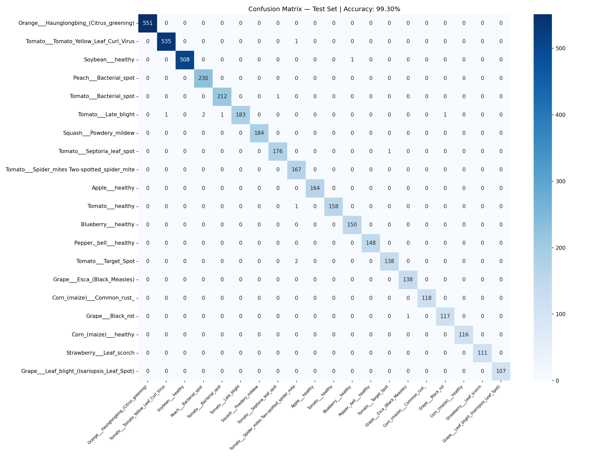

# 🌿 Plant Disease Detector — EfficientNet-B4

A deep learning system that detects plant diseases from leaf images using 
**EfficientNet-B4** fine-tuned on the PlantVillage dataset.
Achieves **99.30% test accuracy** across 38 plant disease classes.

---

## 📊 Results

| Metric | Score |
|---|---|
| Test Accuracy | **99.30%** |
| Best Val Accuracy | **99.28%** |
| Macro F1 | **0.99** |
| Classes | 38 |
| Train Images | 43,444 |
| Test Images | 5,431 |
| Model Size | 71 MB |

---

## 🏗️ Workflow & Design Decisions

### 1. Dataset — PlantVillage
Used the PlantVillage dataset with 38 disease classes across 14 crop species 
(~54K images). It is the most widely used benchmark for plant disease detection, 
making results directly comparable to published research. The dataset comes 
pre-split into train (43K) and val (10K). Since no test split existed, the val 
set was divided 50/50 into val and test using stratified splitting to ensure 
equal class representation in both.

### 2. Backbone — EfficientNet-B4
Chose EfficientNet-B4 over other architectures because it achieves the best 
accuracy-to-size tradeoff. It was pre-trained on ImageNet (1.2M images, 1000 
classes), giving it strong low-level feature detectors (edges, textures, shapes) 
that transfer well to plant leaf images. The model outputs 1792-dimensional 
feature vectors which are passed to a custom classification head.

### 3. Partial Fine-Tuning with Differential LR
All layers are frozen initially. The last 2 blocks (blocks 6 and 7) are unfrozen 
for domain adaptation — these high-level layers learn plant-specific features 
while early frozen layers retain general ImageNet features. A differential 
learning rate strategy is used: backbone unfrozen layers get LR × 0.1 (3e-5) 
while the new classifier head gets full LR (3e-4). This prevents catastrophic 
forgetting of pretrained features.

### 4. Custom Classifier Head
The original ImageNet head (1000 classes) is replaced with:
`1792 → Dropout(0.4) → Linear(512) → GELU → Dropout(0.3) → Linear(38)`
GELU activation is used because it is smoother than ReLU and works better with 
pretrained transformer-style features. Two dropout layers prevent overfitting 
on the relatively small training set.

### 5. Training Strategy
- **AdamW** with weight decay (1e-4) — better regularization than Adam
- **Cosine Annealing LR** — smoothly decays LR from 3e-4 to 1e-6 over 15 epochs
- **Label smoothing (0.1)** — prevents overconfident predictions
- **Gradient clipping (1.0)** — prevents exploding gradients
- **Early stopping (patience=4)** — stops when val acc plateaus
- **Data augmentation** — random crop, flips, rotation, color jitter

### 6. Native Resolution
EfficientNet-B4's native input resolution is 380×380 (vs 224×224 for smaller 
variants). Training uses Resize(400) + RandomCrop(380) for augmentation. This 
higher resolution captures finer leaf texture details critical for distinguishing 
visually similar diseases.

---

## 🏛️ Architecture

```text
Leaf Image (380×380)
        ↓
EfficientNet-B4 Backbone
Blocks 0–5: Frozen (ImageNet features)
Blocks 6–7: Unfrozen (domain adaptation)
        ↓
1792-dim feature vector
        ↓
Dropout(0.4)
        ↓
Linear(1792 → 512) + GELU
        ↓
Dropout(0.3)
        ↓
Linear(512 → 38)
        ↓
38-class prediction
```

---

## 📈 Training Curves



## 🔥 Confusion Matrix



---

## 🚀 How to Run

### On Kaggle (Recommended)
1. Open `crop-disease-classification.ipynb`
2. Add dataset: search `mohitsingh1804/plantvillage` in the Data panel
3. Enable GPU T4 x2 accelerator
4. Enable Internet in Settings
5. Click "Save Version" at top right


---

## 📦 Installation

```bash
pip install -r requirements.txt
```

---

## 🌿 Supported Classes (38)

| Crop | Conditions |
|---|---|
| Apple | Apple Scab, Black Rot, Cedar Apple Rust, Healthy |
| Blueberry | Healthy |
| Cherry | Powdery Mildew, Healthy |
| Corn | Cercospora Leaf Spot, Common Rust, Northern Leaf Blight, Healthy |
| Grape | Black Rot, Esca, Leaf Blight, Healthy |
| Orange | Haunglongbing |
| Peach | Bacterial Spot, Healthy |
| Pepper | Bacterial Spot, Healthy |
| Potato | Early Blight, Late Blight, Healthy |
| Raspberry | Healthy |
| Soybean | Healthy |
| Squash | Powdery Mildew |
| Strawberry | Leaf Scorch, Healthy |
| Tomato | Bacterial Spot, Early Blight, Late Blight, Leaf Mold, Septoria, Spider Mites, Target Spot, Yellow Leaf Curl Virus, Mosaic Virus, Healthy |

---

## 🔬 Key Findings

- **Perfect F1 (1.00)** on 18 out of 38 classes
- **Hardest class**: Corn Cercospora Leaf Spot (F1=0.92) — visually similar 
  to Northern Leaf Blight
- Train/Val gap < 0.4% — no overfitting
- Model size only 71MB — 8x smaller than CLIP version (581MB)
- Converged in all 15 epochs with consistent improvement

---

## 🔮 Future Improvements
- The images of this dataset are taken in a controlled lab environment. Fine-tune on real field images for robust deployment in real-world agricultural   environments
- Test on real farm images (not controlled lab backgrounds)
- Add GradCAM visualizations showing which leaf regions the model focuses on
- Deploy as mobile app for field use
- Experiment with EfficientNet-B7 for potentially higher accuracy

---

## 📄 License

GPL-2.0 (inherited from PlantVillage dataset)
